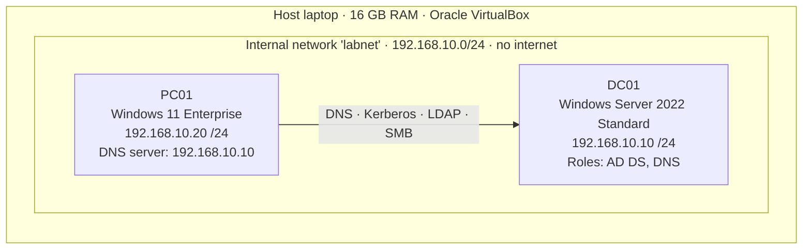
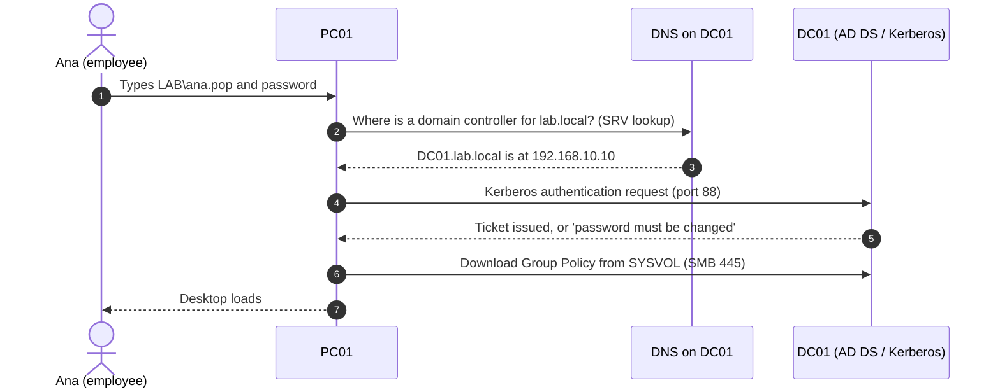
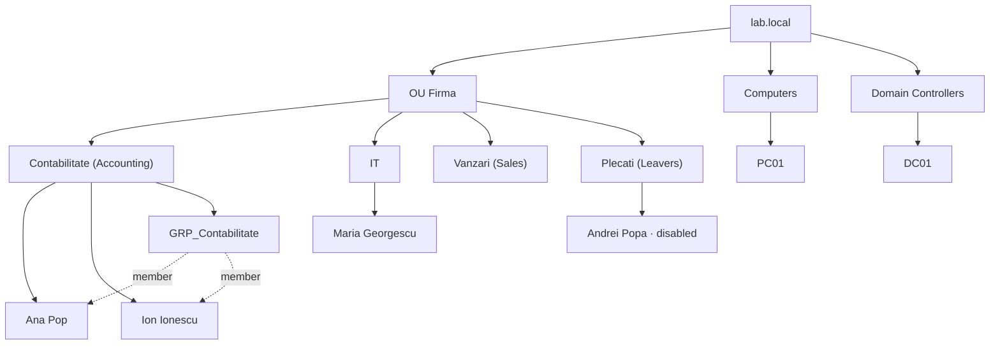

<p align="right">
  <a href="README.md"></a>
  <a href="README.ro.md"></a>
</p>

# 01 · Active Directory & Helpdesk Basics

> **Goal:** start with an empty laptop and end with a working company network: a domain controller, an employee PC joined to the domain, departments, users, groups, and four common Level 1 helpdesk tickets.

### At a glance

| | |
|---|---|
| **Goal** | Build a Windows domain from scratch and practise L1 user administration |
| **Tools** | Oracle VirtualBox, Windows Server 2022 (eval), Windows 11 Enterprise (eval), PowerShell, ADUC, Group Policy Management |
| **Result** | Domain `lab.local` · DC `DC01` · client `PC01` · 4 OUs · 4 users · 1 security group · 4 tickets resolved |
| **Skills** | AD DS, DNS, static IP addressing, domain join, OU/group design, password reset, account lockout, onboarding/offboarding |

**Contents:** [Architecture](#architecture) · [Protocols](#protocols-and-ports-involved) · [Phase 1](#phase-1--building-the-domain-controller) · [Phase 2](#phase-2--joining-a-workstation-to-the-domain) · [Phase 3](#phase-3--company-structure-in-active-directory) · [Phase 4](#phase-4--helpdesk-tickets)

---

## Architecture



### Addressing plan

| Host | Role | OS | IP address | Subnet mask | DNS server | VM resources |
|---|---|---|---|---|---|---|
| **DC01** | Domain controller + DNS | Windows Server 2022 Standard (Desktop Experience) | `192.168.10.10` | `255.255.255.0` | `127.0.0.1` (itself) | 2 vCPU · 4 GB · 50 GB |
| **PC01** | Employee workstation | Windows 11 Enterprise | `192.168.10.20` | `255.255.255.0` | `192.168.10.10` | 2 vCPU · 4 GB · 64 GB |

**Why an internal network?** Both VMs are attached to a VirtualBox *Internal Network* called `labnet`. They can talk to each other but not to my home network or the internet, so nothing done in the lab can affect anything outside it.


**Why static IPs and no gateway?** Servers get fixed addresses so clients can always find them. There is no router in this lab, so no default gateway is needed.

---

## Protocols and ports involved

| Protocol | Port(s) | What it does here |
|---|---|---|
| **DNS** | 53 TCP/UDP | Translates names to IPs. Clients find domain controllers through DNS **SRV records** (e.g. `_ldap._tcp.dc._msdcs.lab.local`). |
| **Kerberos** | 88 TCP/UDP | Default authentication protocol for domain logons. |
| **LDAP** | 389 TCP/UDP | Reading and querying the directory: ADUC and the DC locator use it. |
| **AD Web Services** | 9389 TCP | Used by the PowerShell AD module (`Get-ADUser`, `Get-ADDomain`). |
| **SMB** | 445 TCP | Access to the `SYSVOL` and `NETLOGON` shares, which is how clients download Group Policy. |
| **RPC** | 135 TCP + dynamic 49152–65535 | Remote management and parts of the domain join process. |
| **Global Catalog** | 3268 TCP | Forest-wide searches. |
| **W32Time (NTP)** | 123 UDP | Time sync. Kerberos fails if client and DC clocks differ by more than 5 minutes. |

### What happens when an employee logs in



---

## Phase 1 — Building the domain controller

### 1.1 Virtual machine

| Setting | Value | Why |
|---|---|---|
| ISO | Windows Server 2022 Evaluation (180 days, Microsoft Evaluation Center) | Free and legal for labs |
| Unattended install | **Skipped** | VirtualBox's automatic install caused a setup error |
| Edition | Standard Evaluation **(Desktop Experience)** | Gives a GUI; Server Core has none |
| Network | Internal Network → `labnet` | Isolated lab network |
| Audio | Disabled | Not needed on a server; reduced freezes |

### 1.2 Configuration (PowerShell, run as Administrator)

```powershell
# 1. Give the server a meaningful name (before promotion: renaming a DC later is risky)
Rename-Computer -NewName DC01 -Restart

# 2. Find the network adapter's name
Get-NetAdapter

# 3. Static IP: clients must always find the DC at the same address
New-NetIPAddress -InterfaceAlias "Ethernet" -IPAddress 192.168.10.10 -PrefixLength 24

# 4. The DC will be its own DNS server
Set-DnsClientServerAddress -InterfaceAlias "Ethernet" -ServerAddresses 127.0.0.1

# 5. Install the Active Directory role and its management consoles
Install-WindowsFeature AD-Domain-Services -IncludeManagementTools

# 6. Create a new forest and the domain lab.local (also installs DNS)
Install-ADDSForest -DomainName "lab.local"

# 7. Verify
Get-ADDomain
```

<details>
<summary><b>What each step means</b></summary>

- **`-PrefixLength 24`** = subnet mask `255.255.255.0`. Addresses `192.168.10.1` to `192.168.10.254` are on the same network and can talk directly.
- **DNS `127.0.0.1`** means "ask myself". Active Directory depends on DNS, and the DC hosts the DNS zone for `lab.local`.
- **`Install-WindowsFeature`** only installs the binaries. `-IncludeManagementTools` adds consoles like *Active Directory Users and Computers* (ADUC).
- **`Install-ADDSForest`** creates the *forest* (the top-level AD container), the domain `lab.local`, and promotes the server to domain controller. It asks for a **DSRM password**, an emergency password used only to repair the AD database.
- **`Get-ADDomain`** confirmed `DC01.lab.local` holds the domain's operations master roles (e.g. *PDC Emulator*, *RID Master*), as expected for a single-DC domain.

</details>

Command history recovered from the server (`notepad (Get-PSReadLineOption).HistorySavePath`):


<!-- OPTIONAL SCREENSHOT: to show it, delete this line and the closing line under the image.

-->

A VM snapshot named **"Domeniu gata"** ("domain ready") was taken at this point.

---

## Phase 2 — Joining a workstation to the domain

### 2.1 Virtual machine

Windows 11 Enterprise Evaluation, with **UEFI + Secure Boot + TPM 2.0** enabled (Windows 11 requires them), connected to the same `labnet` network. Installed with a **local account** first, because a PC can only use domain accounts after it has joined the domain.

### 2.2 Network configuration and domain join

```powershell
# 1. Name and static IP in the same subnet as DC01
Rename-Computer -NewName PC01 -Restart
New-NetIPAddress -InterfaceAlias "Ethernet" -IPAddress 192.168.10.20 -PrefixLength 24

# 2. Point DNS at the domain controller
Set-DnsClientServerAddress -InterfaceAlias "Ethernet" -ServerAddresses 192.168.10.10

# 3. Verify before joining
ipconfig
nslookup lab.local

# 4. Join the domain (prompts for LAB\Administrator's password), then reboot
Add-Computer -DomainName lab.local -Credential LAB\Administrator -Restart
```

`ipconfig` shows the correct address, and `nslookup` resolves `lab.local` to the DC:


> The `DNS request timed out` / `Server: UnKnown` lines are harmless here: `nslookup` first tries to look up the DNS server's own *name* via a reverse lookup zone, which this lab doesn't have. The actual answer (`lab.local → 192.168.10.10`) is correct.

Command history on PC01:


### 2.3 Verification

- Logged in on PC01 as `LAB\Administrator` (via **Other user**). The `LAB\` prefix tells Windows to authenticate against the domain, not a local account.
- PC01 appears as a computer object in ADUC:


---

## Phase 3 — Company structure in Active Directory

### 3.1 Design



| Decision | Reason |
|---|---|
| A top-level OU **Firma** instead of the default `Users` container | `Users` and `Computers` are *containers*, not OUs: you can't link Group Policy to them or delegate them cleanly |
| One OU per department | Department-specific policies and delegated permissions |
| **Protect from accidental deletion** left on | Deleting an OU deletes everything inside it |
| Permissions go to **groups**, not to individual users | When someone changes department, you change their group membership and every permission follows |
| Group `GRP_Contabilitate`: **Global** scope, **Security** type | Global = members from this domain; Security = can be used for permissions |
| A separate **Plecati** (leavers) OU | Disabled accounts are kept apart |


### 3.2 Users

Created in ADUC (**right-click the OU → New → User**) with a temporary password and **"User must change password at next logon"** ticked.

| Name | Logon name | OU | Status |
|---|---|---|---|
| Ana Pop | `ana.pop` | Contabilitate | Active · member of GRP_Contabilitate |
| Ion Ionescu | `ion.ionescu` | Contabilitate | Active · member of GRP_Contabilitate |
| Maria Georgescu | `maria.georgescu` | IT | Active |
| Andrei Popa | `andrei.popa` | Plecati | **Disabled** |

User report from PowerShell:

```powershell
Get-ADUser -Filter * -SearchBase "OU=Firma,DC=lab,DC=local" -Properties Description |
    Select-Object Name, Enabled, Description, DistinguishedName |
    Format-Table -AutoSize
```


<!-- OPTIONAL SCREENSHOT: to show it, delete this line and the closing line under the image.

-->

---

## Phase 4 — Helpdesk tickets

Ticket types follow ITIL: an **Incident** is something broken; a **Service Request** is a standard request for something new.

### REQ-0001 · New hire onboarding

| | |
|---|---|
| **Type** | Service Request |
| **Request** | Ana Pop starts in Accounting |
| **Actions** | Created `ana.pop` in OU *Contabilitate* with a temporary password and *must change password at next logon*; added to `GRP_Contabilitate` |
| **Verification** | Ana logged in on PC01 as `LAB\ana.pop` and was forced to set her own password |

### REQ-0002 · Password reset

| | |
|---|---|
| **Type** | Service Request |
| **Request** | Password reset for Maria Georgescu |
| **Actions** | ADUC → user → right-click → **Reset Password** → temporary password + *User must change password at next logon* |
| **Verification** | At next logon on PC01 the user was forced to choose a new password |


### INC-0003 · Account locked

| | |
|---|---|
| **Type** | Incident |
| **Initial state** | By default a new domain never locks accounts (threshold = 0) |
| **Configuration** | **Group Policy Management** → `Default Domain Policy` → *Computer Configuration › Policies › Windows Settings › Security Settings › Account Policies › Account Lockout Policy* → **threshold 5** attempts, **duration 30 min**, **reset counter after 30 min** → `gpupdate /force` |
| **Test** | 5 wrong passwords for `ion.ionescu` on PC01 → account locked |
| **Resolution** | ADUC → user → **Account** tab → *Unlock account* |

> Password and lockout settings for domain accounts only take effect from a GPO linked at the **domain** level, which is why the Default Domain Policy was used.

> *No screenshots were captured for this ticket.*

### REQ-0004 · Employee offboarding

| | |
|---|---|
| **Type** | Service Request |
| **Request** | Andrei Popa leaves the company |
| **Actions** | 1. **Disable** the account (not delete) · 2. Description: *plecat* (left) · 3. Remove from all groups except *Domain Users* · 4. **Move** to OU *Plecati* |
| **Verification** | `Enabled = False` and `OU=Plecati` in the user report above |

**Why disable instead of delete?**

- Every account has a unique **SID**. Delete it and recreate it, and you get a *different* account that has lost all its old permissions.
- The manager may need the leaver's files or mailbox for weeks.
- If the person returns, re-enabling takes one click.

<!-- OPTIONAL SCREENSHOT: to show it, delete this line and the closing line under the image.

-->

<p align="right"><a href="../README.md">Back to the portfolio</a></p>
