<p align="right">
  <a href="README.md"></a>
  <a href="README.ro.md"></a>
</p>

# 01 · Active Directory și noțiuni de bază de helpdesk

> **Obiectiv:** pornind de la un laptop gol, să ajung la o rețea de firmă funcțională: un controller de domeniu, un PC de angajat adăugat în domeniu, departamente, utilizatori, grupuri și patru tichete uzuale de helpdesk de nivel 1.

### Pe scurt

| | |
|---|---|
| **Obiectiv** | Construirea unui domeniu Windows de la zero și exersarea administrării utilizatorilor la nivel L1 |
| **Unelte** | Oracle VirtualBox, Windows Server 2022 (eval), Windows 11 Enterprise (eval), PowerShell, ADUC, Group Policy Management |
| **Rezultat** | Domeniul `lab.local` · DC `DC01` · client `PC01` · 4 OU-uri · 4 utilizatori · 1 grup de securitate · 4 tichete rezolvate |
| **Competențe** | AD DS, DNS, adresare IP statică, adăugare în domeniu, proiectare OU/grupuri, resetare parolă, blocare cont, onboarding/offboarding |

**Cuprins:** [Arhitectură](#arhitectură) · [Protocoale](#protocoale-și-porturi-implicate) · [Faza 1](#faza-1--construirea-controllerului-de-domeniu) · [Faza 2](#faza-2--adăugarea-unei-stații-de-lucru-în-domeniu) · [Faza 3](#faza-3--structura-firmei-în-active-directory) · [Faza 4](#faza-4--tichete-de-helpdesk)

---

## Arhitectură

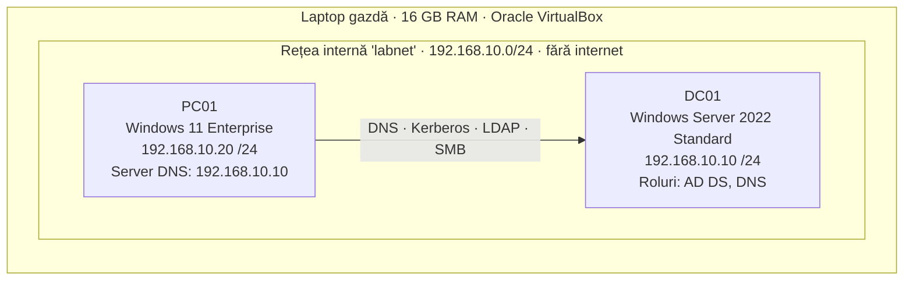

### Planul de adrese

| Gazdă | Rol | Sistem de operare | Adresă IP | Mască de subrețea | Server DNS | Resurse VM |
|---|---|---|---|---|---|---|
| **DC01** | Controller de domeniu + DNS | Windows Server 2022 Standard (Desktop Experience) | `192.168.10.10` | `255.255.255.0` | `127.0.0.1` (el însuși) | 2 vCPU · 4 GB · 50 GB |
| **PC01** | Stație de lucru angajat | Windows 11 Enterprise | `192.168.10.20` | `255.255.255.0` | `192.168.10.10` | 2 vCPU · 4 GB · 64 GB |

**De ce o rețea internă?** Ambele mașini virtuale sunt conectate la o *Internal Network* din VirtualBox numită `labnet`. Pot comunica între ele, dar nu și cu rețeaua de acasă sau cu internetul, așa că nimic din ce se face în lab nu poate afecta ceva din afara lui.

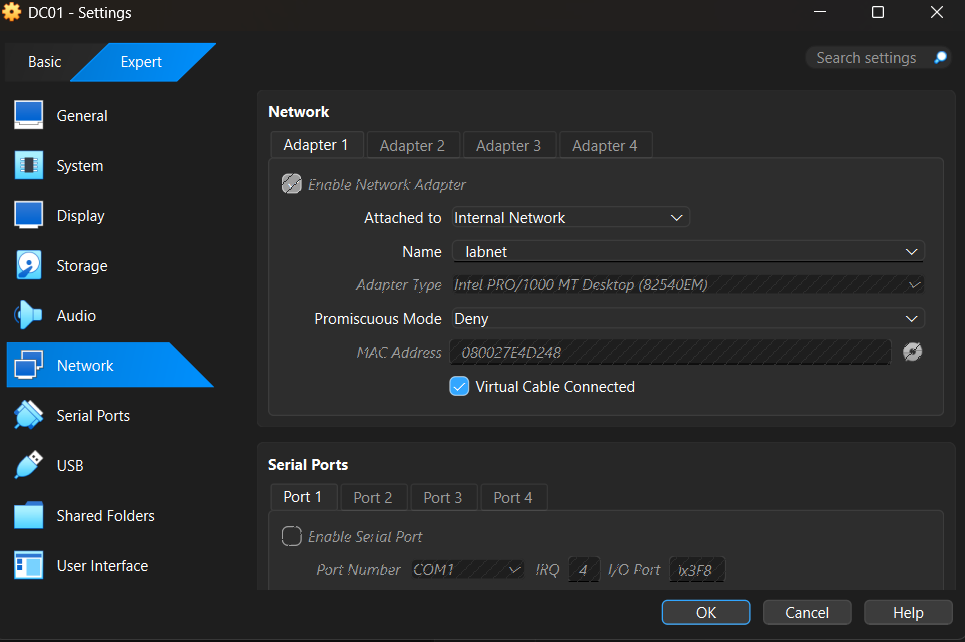

**De ce IP-uri statice și fără gateway?** Serverele primesc adrese fixe ca să poată fi găsite mereu de clienți. În acest lab nu există router, deci nu e nevoie de default gateway.

---

## Protocoale și porturi implicate

| Protocol | Port(uri) | Ce face aici |
|---|---|---|
| **DNS** | 53 TCP/UDP | Traduce nume în IP-uri. Clienții găsesc controllerele de domeniu prin **înregistrări SRV** din DNS (de ex. `_ldap._tcp.dc._msdcs.lab.local`). |
| **Kerberos** | 88 TCP/UDP | Protocolul implicit de autentificare pentru logările în domeniu. |
| **LDAP** | 389 TCP/UDP | Citirea și interogarea directorului: îl folosesc ADUC și mecanismul de localizare a DC-ului. |
| **AD Web Services** | 9389 TCP | Folosit de modulul PowerShell pentru AD (`Get-ADUser`, `Get-ADDomain`). |
| **SMB** | 445 TCP | Acces la share-urile `SYSVOL` și `NETLOGON`, de unde clienții descarcă Group Policy. |
| **RPC** | 135 TCP + dinamic 49152–65535 | Administrare la distanță și o parte din procesul de adăugare în domeniu. |
| **Global Catalog** | 3268 TCP | Căutări la nivelul întregii păduri (forest). |
| **W32Time (NTP)** | 123 UDP | Sincronizarea orei. Kerberos eșuează dacă ceasurile clientului și ale DC-ului diferă cu mai mult de 5 minute. |

### Ce se întâmplă când un angajat se loghează

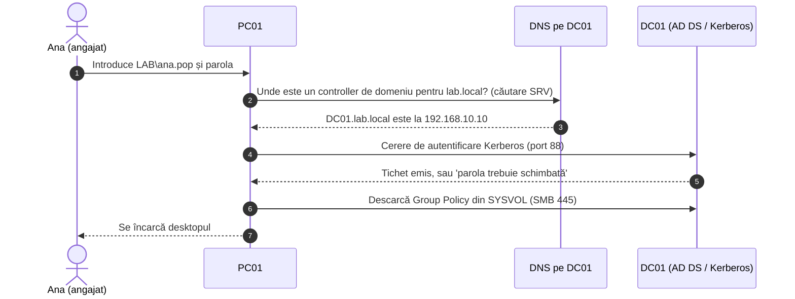

---

## Faza 1 — Construirea controllerului de domeniu

### 1.1 Mașina virtuală

| Setare | Valoare | De ce |
|---|---|---|
| ISO | Windows Server 2022 Evaluation (180 de zile, Microsoft Evaluation Center) | Gratuit și legal pentru laboratoare |
| Instalare automată (Unattended) | **Dezactivată** | Instalarea automată a VirtualBox a cauzat o eroare de setup |
| Ediție | Standard Evaluation **(Desktop Experience)** | Oferă interfață grafică; Server Core nu are |
| Rețea | Internal Network → `labnet` | Rețea izolată de laborator |
| Audio | Dezactivat | Nu e necesar pe un server; a redus blocajele |

### 1.2 Configurare (PowerShell, rulat ca Administrator)

```powershell
# 1. Un nume clar pentru server (înainte de promovare: redenumirea unui DC ulterior e riscantă)
Rename-Computer -NewName DC01 -Restart

# 2. Aflarea numelui adaptorului de rețea
Get-NetAdapter

# 3. IP static: clienții trebuie să găsească DC-ul mereu la aceeași adresă
New-NetIPAddress -InterfaceAlias "Ethernet" -IPAddress 192.168.10.10 -PrefixLength 24

# 4. DC-ul va fi propriul server DNS
Set-DnsClientServerAddress -InterfaceAlias "Ethernet" -ServerAddresses 127.0.0.1

# 5. Instalarea rolului Active Directory și a consolelor de administrare
Install-WindowsFeature AD-Domain-Services -IncludeManagementTools

# 6. Crearea unei păduri noi și a domeniului lab.local (instalează și DNS)
Install-ADDSForest -DomainName "lab.local"

# 7. Verificare
Get-ADDomain
```

<details>
<summary><b>Ce înseamnă fiecare pas</b></summary>

- **`-PrefixLength 24`** = masca de subrețea `255.255.255.0`. Adresele de la `192.168.10.1` la `192.168.10.254` sunt în aceeași rețea și comunică direct.
- **DNS `127.0.0.1`** înseamnă „întreabă-mă pe mine”. Active Directory depinde de DNS, iar DC-ul găzduiește zona DNS pentru `lab.local`.
- **`Install-WindowsFeature`** doar instalează fișierele rolului. `-IncludeManagementTools` adaugă console precum *Active Directory Users and Computers* (ADUC).
- **`Install-ADDSForest`** creează *pădurea* (forest, containerul de nivel cel mai înalt din AD), domeniul `lab.local` și promovează serverul la controller de domeniu. Cere o **parolă DSRM**, o parolă de urgență folosită doar pentru repararea bazei de date AD.
- **`Get-ADDomain`** a confirmat că `DC01.lab.local` deține rolurile de operations master ale domeniului (de ex. *PDC Emulator*, *RID Master*), cum e de așteptat într-un domeniu cu un singur DC.

</details>

Istoricul comenzilor recuperat de pe server (`notepad (Get-PSReadLineOption).HistorySavePath`):

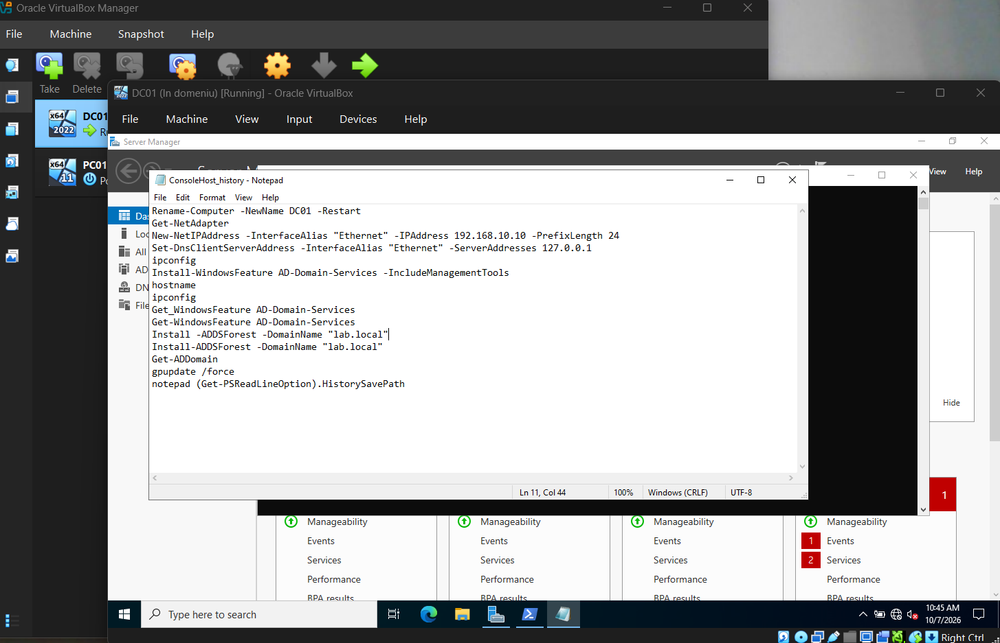

<!-- OPTIONAL SCREENSHOT: to show it, delete this line and the closing line under the image.

-->

În acest punct a fost creat un snapshot al mașinii virtuale, numit **„Domeniu gata”**.

---

## Faza 2 — Adăugarea unei stații de lucru în domeniu

### 2.1 Mașina virtuală

Windows 11 Enterprise Evaluation, cu **UEFI + Secure Boot + TPM 2.0** activate (necesare pentru Windows 11), conectat la aceeași rețea `labnet`. Instalat inițial cu un **cont local**, pentru că un PC poate folosi conturi de domeniu doar după ce a fost adăugat în domeniu.

### 2.2 Configurarea rețelei și adăugarea în domeniu

```powershell
# 1. Nume și IP static în aceeași subrețea cu DC01
Rename-Computer -NewName PC01 -Restart
New-NetIPAddress -InterfaceAlias "Ethernet" -IPAddress 192.168.10.20 -PrefixLength 24

# 2. DNS-ul setat pe controllerul de domeniu
Set-DnsClientServerAddress -InterfaceAlias "Ethernet" -ServerAddresses 192.168.10.10

# 3. Verificare înainte de adăugarea în domeniu
ipconfig
nslookup lab.local

# 4. Adăugarea în domeniu (cere parola pentru LAB\Administrator), apoi restart
Add-Computer -DomainName lab.local -Credential LAB\Administrator -Restart
```

`ipconfig` arată adresa corectă, iar `nslookup` rezolvă `lab.local` la DC:

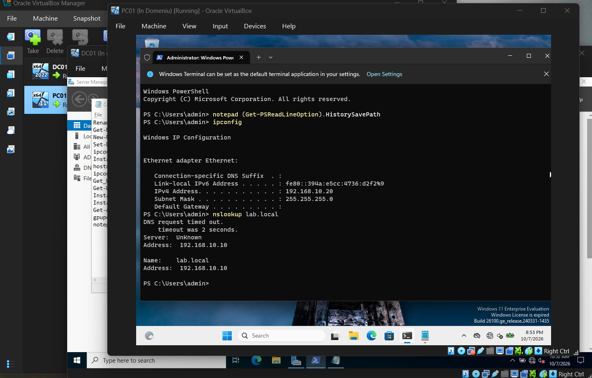

> Rândurile `DNS request timed out` / `Server: UnKnown` sunt inofensive aici: `nslookup` încearcă întâi să afle *numele* propriului server DNS printr-o zonă de căutare inversă (reverse lookup zone), pe care acest lab nu o are. Răspunsul propriu-zis (`lab.local → 192.168.10.10`) este corect.

Istoricul comenzilor pe PC01:

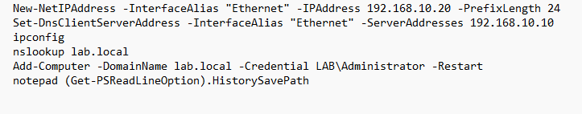

### 2.3 Verificare

- Logare pe PC01 ca `LAB\Administrator` (prin **Other user**). Prefixul `LAB\` îi spune Windows-ului să autentifice contul în domeniu, nu ca pe un cont local.
- PC01 apare ca obiect de tip computer în ADUC:

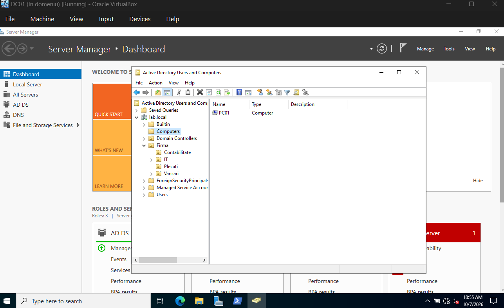

---

## Faza 3 — Structura firmei în Active Directory

### 3.1 Proiectare

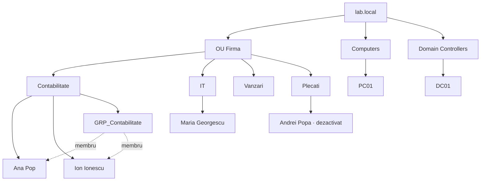

| Decizie | Motiv |
|---|---|
| Un OU principal **Firma** în locul containerului implicit `Users` | `Users` și `Computers` sunt *containere*, nu OU-uri: nu li se pot lega politici Group Policy și nu pot fi delegate curat |
| Câte un OU pentru fiecare departament | Politici specifice fiecărui departament și permisiuni delegate |
| **Protect from accidental deletion** lăsat activ | Ștergerea unui OU șterge tot ce conține |
| Permisiunile se dau **grupurilor**, nu utilizatorilor individuali | Când cineva schimbă departamentul, i se schimbă doar apartenența la grup, iar toate permisiunile se schimbă odată cu ea |
| Grupul `GRP_Contabilitate`: scope **Global**, tip **Security** | Global = membri din acest domeniu; Security = poate fi folosit pentru permisiuni |
| Un OU separat **Plecati** | Conturile dezactivate sunt ținute separat |

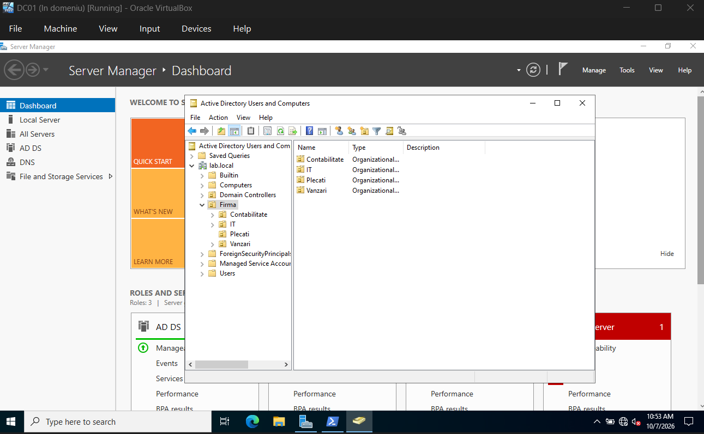

### 3.2 Utilizatori

Creați în ADUC (**click dreapta pe OU → New → User**) cu o parolă temporară și opțiunea **„User must change password at next logon”** bifată.

| Nume | Nume de logare | OU | Stare |
|---|---|---|---|
| Ana Pop | `ana.pop` | Contabilitate | Activ · membru GRP_Contabilitate |
| Ion Ionescu | `ion.ionescu` | Contabilitate | Activ · membru GRP_Contabilitate |
| Maria Georgescu | `maria.georgescu` | IT | Activ |
| Andrei Popa | `andrei.popa` | Plecati | **Dezactivat** |

Raport al utilizatorilor din PowerShell:

```powershell
Get-ADUser -Filter * -SearchBase "OU=Firma,DC=lab,DC=local" -Properties Description |
    Select-Object Name, Enabled, Description, DistinguishedName |
    Format-Table -AutoSize
```

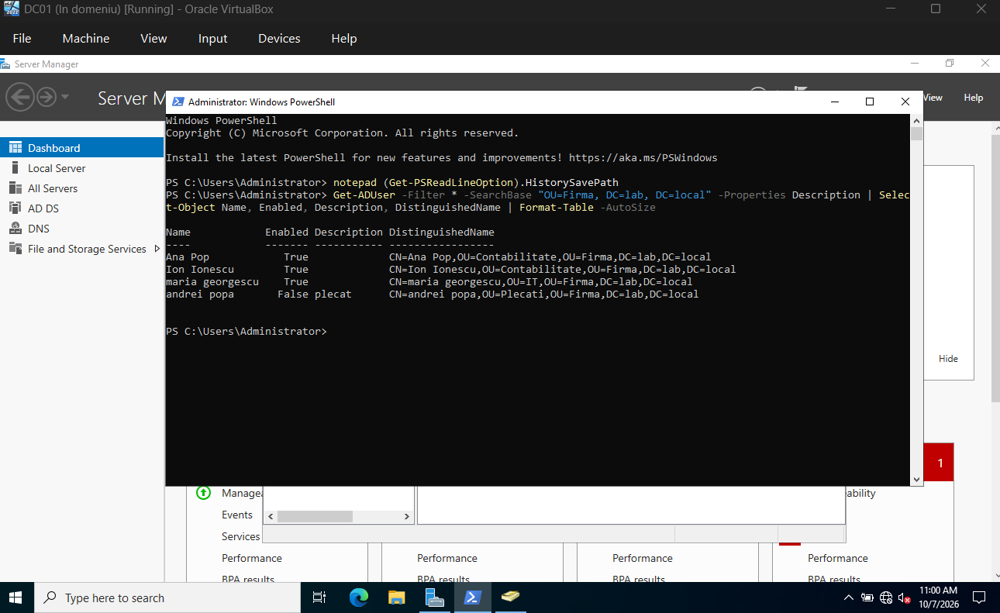

<!-- OPTIONAL SCREENSHOT: to show it, delete this line and the closing line under the image.

-->

---

## Faza 4 — Tichete de helpdesk

Tipurile de tichete urmează ITIL: un **Incident** înseamnă ceva care nu funcționează; un **Service Request** este o cerere standard pentru ceva nou.

### REQ-0001 · Onboarding angajat nou

| | |
|---|---|
| **Tip** | Service Request |
| **Cerere** | Ana Pop începe lucrul la Contabilitate |
| **Acțiuni** | Creat `ana.pop` în OU-ul *Contabilitate*, cu parolă temporară și *must change password at next logon*; adăugat în `GRP_Contabilitate` |
| **Verificare** | Ana s-a logat pe PC01 ca `LAB\ana.pop` și a fost obligată să-și seteze propria parolă |

### REQ-0002 · Resetare parolă

| | |
|---|---|
| **Tip** | Service Request |
| **Cerere** | Resetarea parolei pentru Maria Georgescu |
| **Acțiuni** | ADUC → utilizator → click dreapta → **Reset Password** → parolă temporară + *User must change password at next logon* |
| **Verificare** | La următoarea logare pe PC01, utilizatorul a fost obligat să aleagă o parolă nouă |

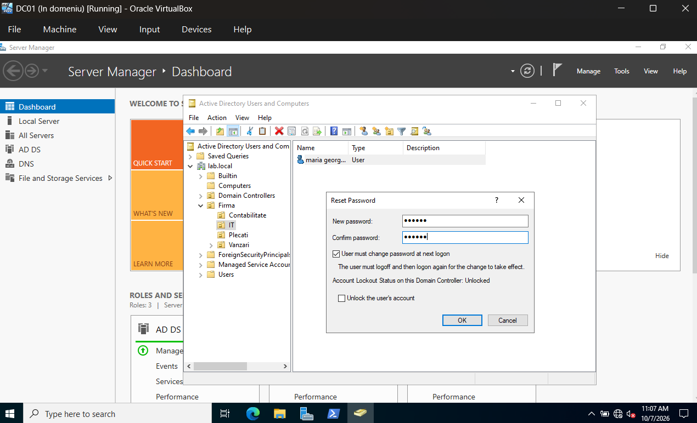

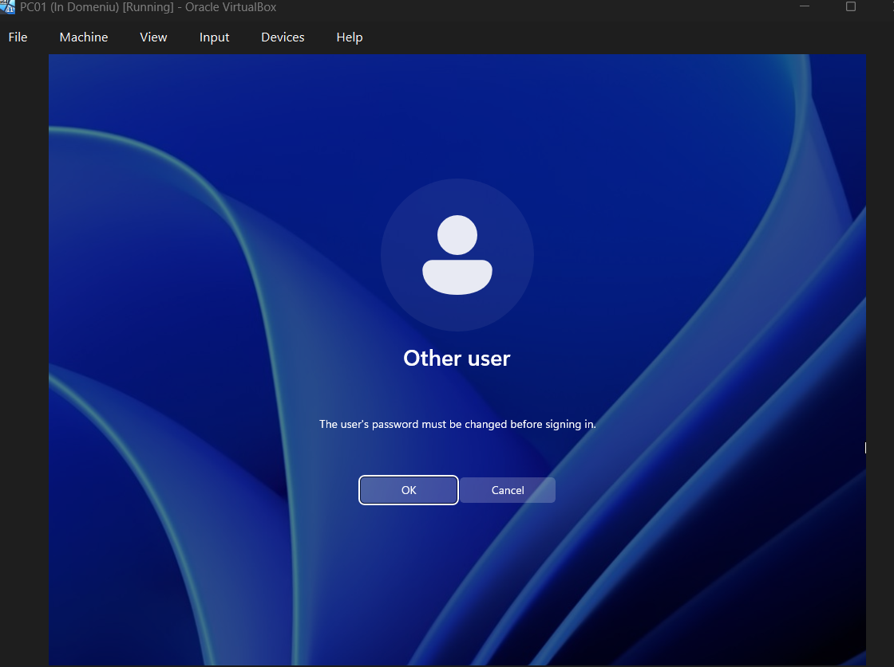

### INC-0003 · Cont blocat

| | |
|---|---|
| **Tip** | Incident |
| **Situația inițială** | Implicit, un domeniu nou nu blochează niciodată conturile (prag = 0) |
| **Configurare** | **Group Policy Management** → `Default Domain Policy` → *Computer Configuration › Policies › Windows Settings › Security Settings › Account Policies › Account Lockout Policy* → **prag 5** încercări, **durată 30 min**, **resetare contor după 30 min** → `gpupdate /force` |
| **Test** | 5 parole greșite pentru `ion.ionescu` pe PC01 → cont blocat |
| **Rezolvare** | ADUC → utilizator → tab-ul **Account** → *Unlock account* |

> Setările de parolă și de blocare pentru conturile de domeniu au efect doar dintr-un GPO legat la nivelul **domeniului**, de aceea a fost folosit Default Domain Policy.

> *Pentru acest tichet nu au fost realizate capturi de ecran.*

### REQ-0004 · Offboarding angajat

| | |
|---|---|
| **Tip** | Service Request |
| **Cerere** | Andrei Popa pleacă din firmă |
| **Acțiuni** | 1. **Dezactivarea** contului (nu ștergerea) · 2. Descriere: *plecat* · 3. Scoaterea din toate grupurile, cu excepția *Domain Users* · 4. **Mutarea** în OU-ul *Plecati* |
| **Verificare** | `Enabled = False` și `OU=Plecati` în raportul utilizatorilor de mai sus |

**De ce dezactivare și nu ștergere?**

- Fiecare cont are un **SID** unic. Dacă îl ștergi și îl recreezi, obții un cont *diferit*, care a pierdut toate permisiunile vechi.
- Managerul poate avea nevoie de fișierele sau de mailul persoanei plecate timp de câteva săptămâni.
- Dacă persoana revine, reactivarea contului durează un click.

<!-- OPTIONAL SCREENSHOT: to show it, delete this line and the closing line under the image.

-->

<p align="right"><a href="../README.md">Înapoi la portofoliu</a></p>
